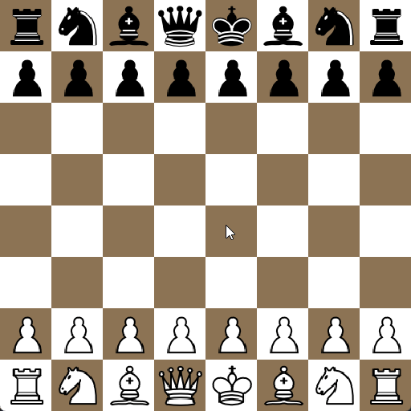

<!-- PROJECT LOGO -->
<br />
<div align="center">
  <a href="https://github.com/github_username/repo_name">
    
  </a>

<h3 align="center">Chess</h3>

  <p align="center">
    A python Chess engine.
    <br />
    Featuring a playable GUI, move generation, and an AI powered by the Negamax algorithm and a supervised Deep Learning Model.
    <br />
    <br />
  </p>
</div>


<!-- ABOUT THE PROJECT -->
## About The Project

The AI uses a [negamax algorithm with alpha beta pruning](https://en.wikipedia.org/wiki/Negamax), but only very modest depths are searched in order to keep computation times reasonable. The AI algorithm is accompanied by a Deep Learning model that was trained on the [Lichess.org database](https://database.lichess.org/) to produce a scalar value which evaluates the board and determines which player is at advantage. The value outputted by the model will be negative if black is advantage and positive if white is.

### Showcase



### Built With

* [Python](https://github.com/python/cpython)
* [Pygame](https://github.com/pygame/pygame)
* [NumPy](https://github.com/numpy/numpy)
* [SQLite](https://github.com/sqlite/sqlite)
* [peewee](https://github.com/coleifer/peewee)
* [PyTorch](https://github.com/pytorch/pytorch)
* [Lightning](https://github.com/Lightning-AI/lightning)

<p align="right">(<a href="#readme-top">back to top</a>)</p>


<!-- GETTING STARTED -->
## Getting Started

To do


### Installation

1. Clone the repo
   ```sh
   git clone https://github.com/gitsuki/chess-game.git
   ```
2. Install packages
   ```sh
   pip install -r requirements.txt
   ```
   
3. Run main.py
   ```sh
   python3 main.py
   ```

<p align="right">(<a href="#readme-top">back to top</a>)</p>
